# Barb's Recipe App 

One of the simplest ways to improve your health is to prepare more meals at home.\
Sometimes everyone of us needs last-minute meal inspiration? **Barb's Recipe App got your back.**
From easy family dinner ideas to vegetarian recipes and beyond, every one of these dishes can be on the table in 30 minutes or less.

The **Main Goal** of this App is to help you with Cooking Ideas.

  - user can enjoy the sign in option & and user is tracked by using \
  Cookies and when the user logout the Session-ID is destroyed
  - after user is logged in she/he has option either to find exact \
  recipe or search partial recipe from the recipe database

## Tech Stack:

### Front End:
- CSS, HTML

### Back End:
- Java 
- MySQL Database     ( ~70k Recipes )

      user table (username & passwords)
      cookie table (username & sessionID & cookie)
      recipe table (recipes - title, ingrediends, instructions, pictures)
      
- **Server:** Java sockets (Java Handlers)

    - Landing Handler
    - Login Handler
    - Homepage Handler
    - Find Handler
    - Search Handler
    - Logout Handler
    - CommingSoon Handler
    - Files Handler

- [**unsplash API**](https://unsplash.com/developers) (not used at the end)

# How to run

After clonning this repository 

### Server side:
      - run by opening folder /java/Application/BarbsRecipeApp.java
      - the server is listening on port 1024
### Client side:      
      - client can connect by typing [http://localhost:1024/](http://localhost:1024/) in the browser 
      - user will be transfered to the landing page of this application

# Stretch Goal 1

## Landing Page
- Forward User to → **Login Page**

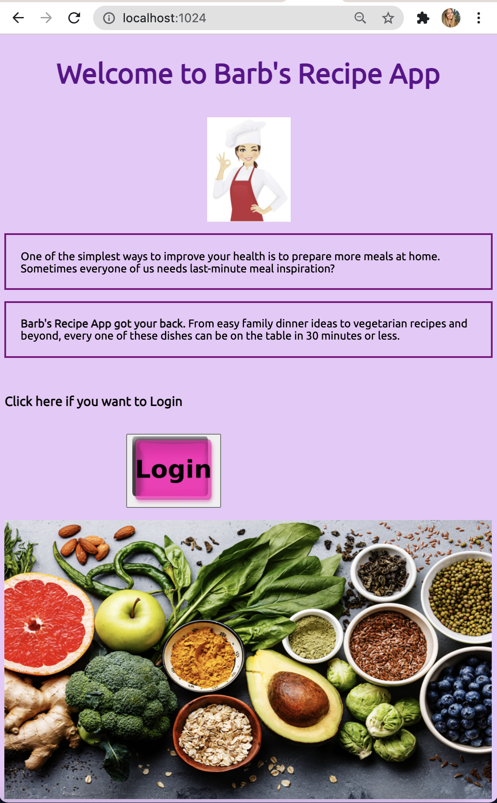

## Login Page
- Create account → **Home Page**
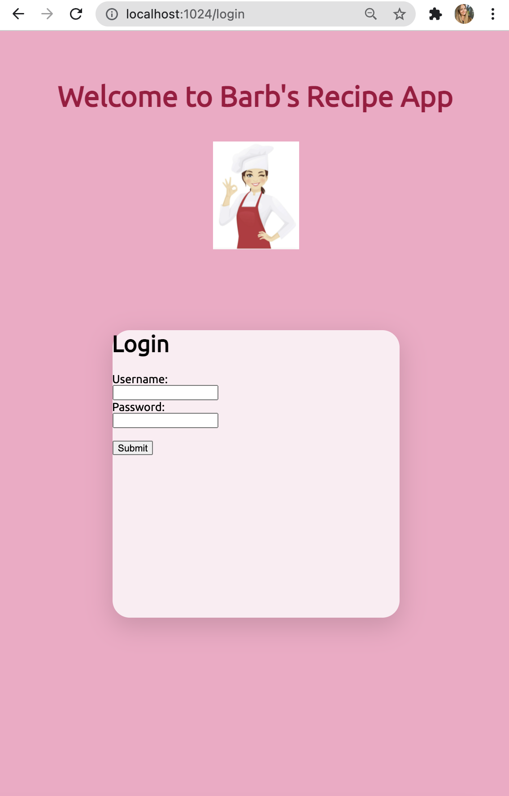

Not Authorized

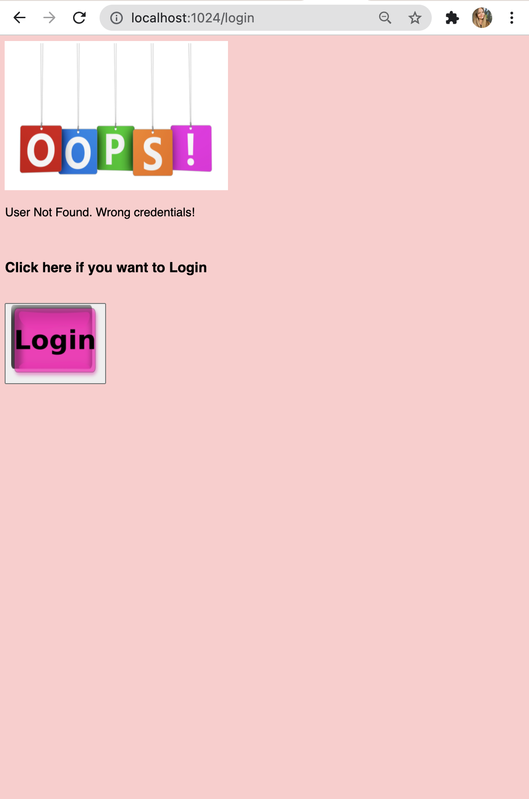

Already Signed In

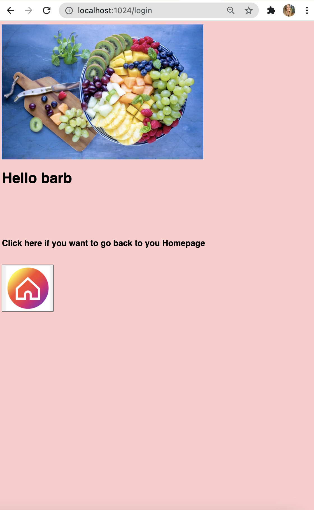

## Home Page

  - Features 
    - Find Button
    - Search Button
    - Logout Button

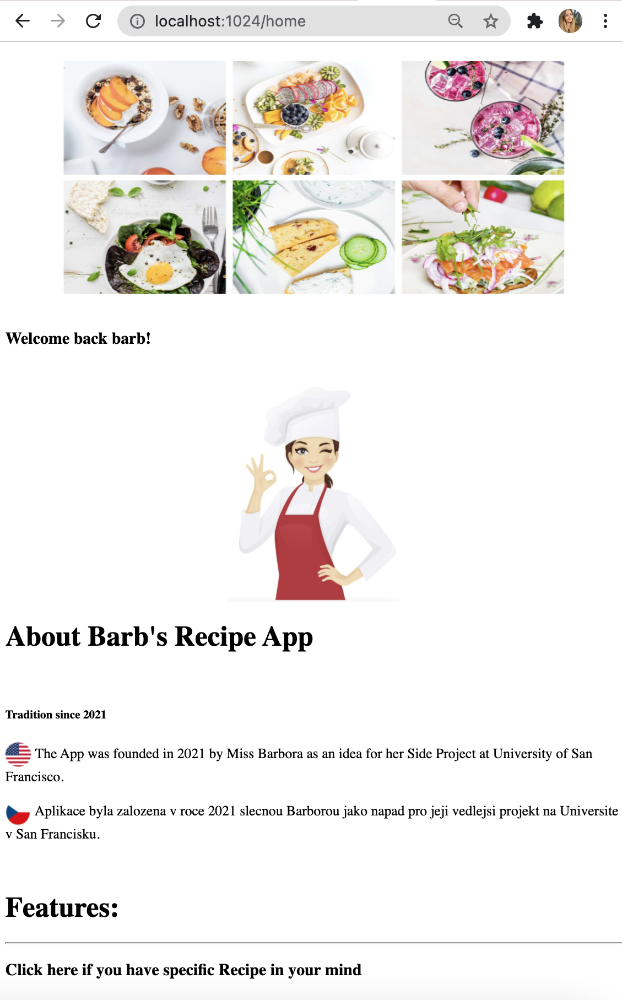

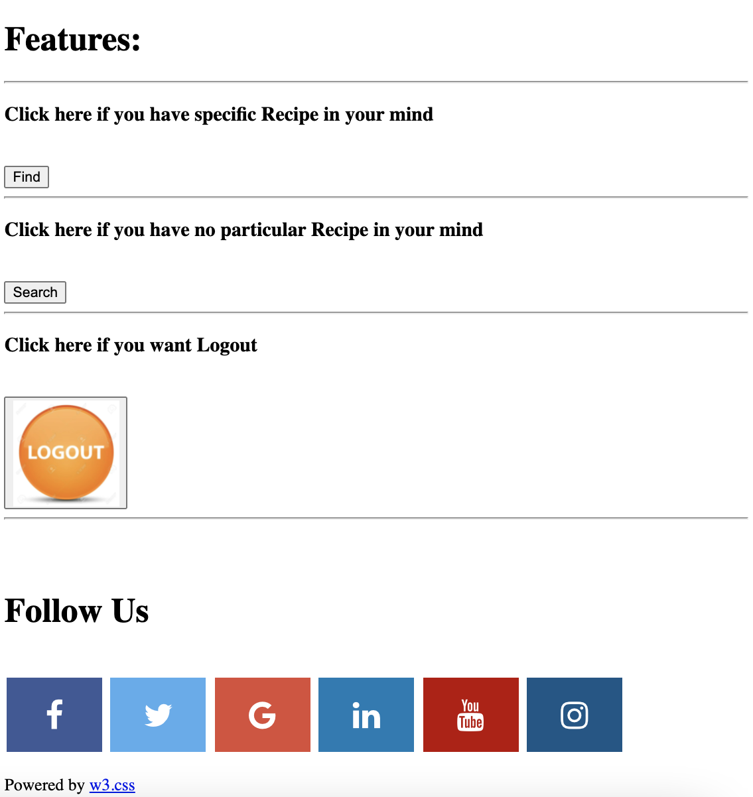

## Find Recipe

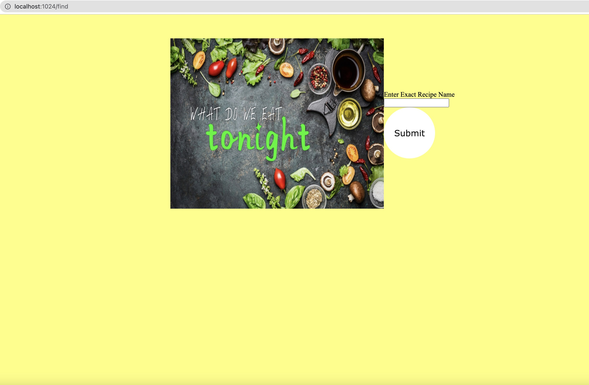

  - Display → **Recipe Page**  
    - Recipe Title
    - Ingredients
    - Instructions
    - Picture

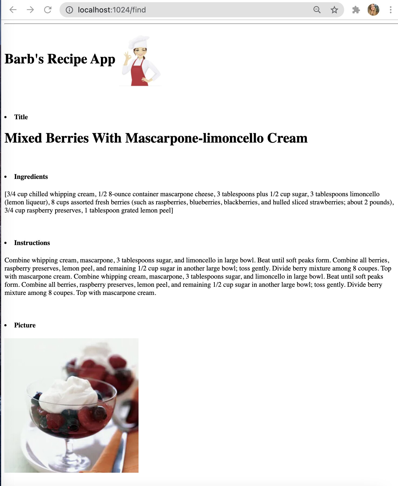

## Search Recipe

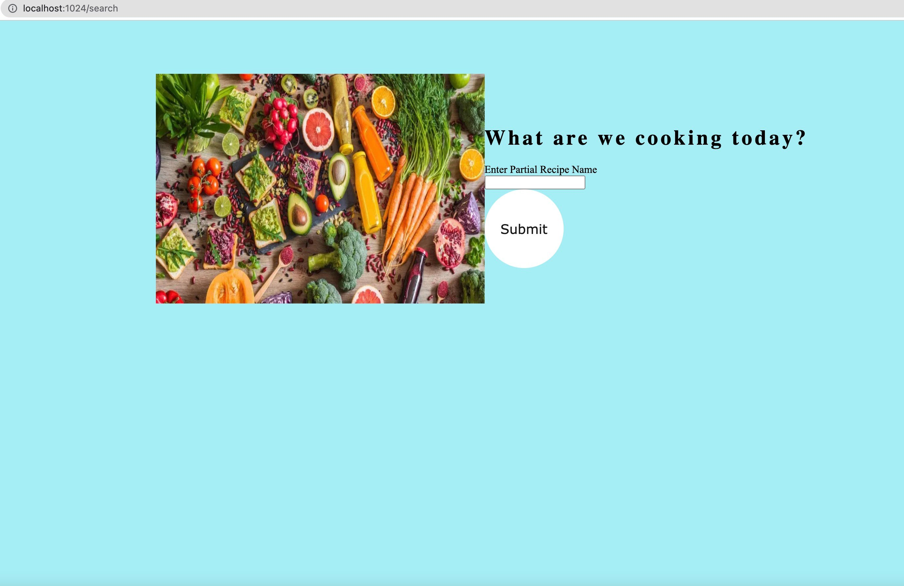

- Display **list with top random** matches
     that can be browsed to see the **Recipe Page**
     
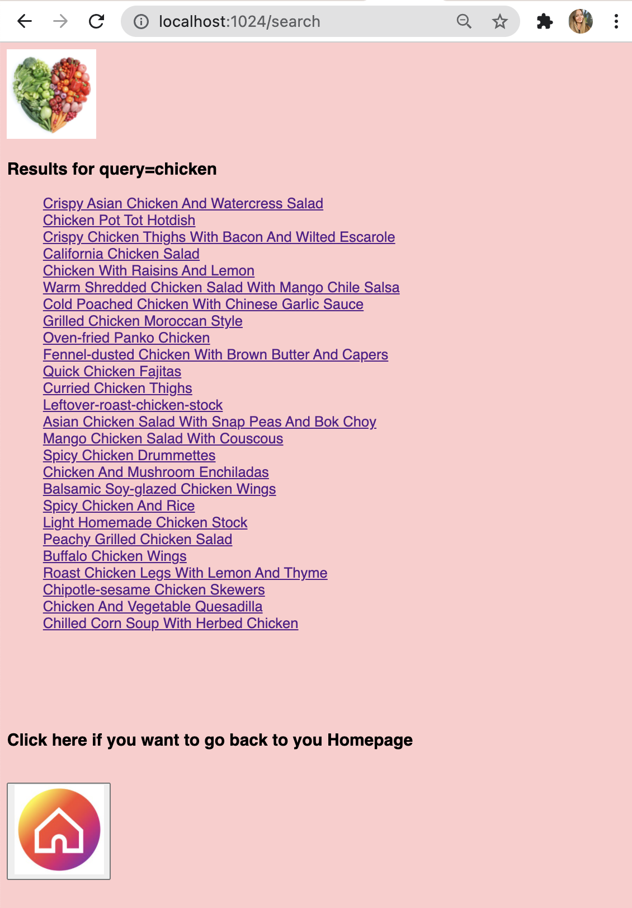

## Logout Page

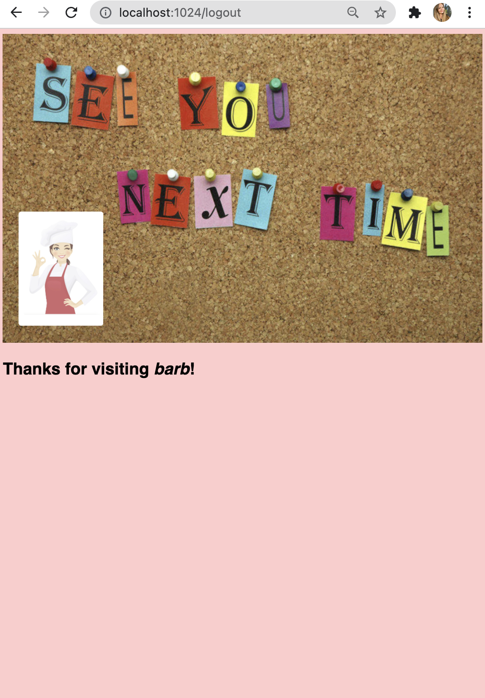

## CommingSoon Page

-for the parts that are in the progress 

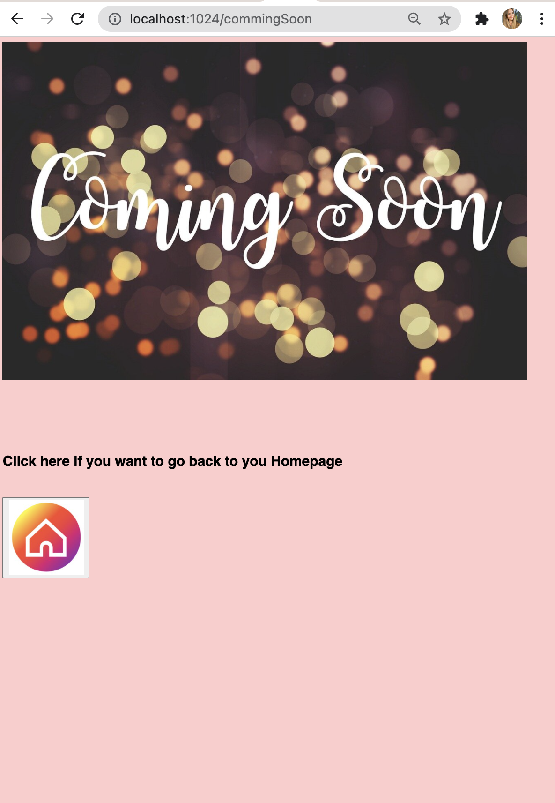

# Stretch Goal 2

- Make this App multilingual; however that needs more time to translate all the REcipe data into other Language.
- Make the Search partial Recipe more personalized

  - Store the previous searches
  - Like/Rate Recipes
  Improve the searching algorithm
- Modify Dataset to add type of Cuisine

## Author

- Barbora Novakova - Graduate MSCS Student at [University of San Francisco](https://www.usfca.edu/)

## 🔗 Links

